# 時系列・地理空間情報に関するデータ分析・可視化システムの試作と実装マニュアル

## WebGISアプリケーション
### 3次元テンプレートWebGISアプリケーション
#### アプリケーションの起動
ブラウザからhttps://tb-gis-web.jgn-x.jp/itowns_template/ にアクセスして起動する。ログインが必要な場合は、画面の指示に従ってログインを行う。起動すると下記のような画面が表示される。

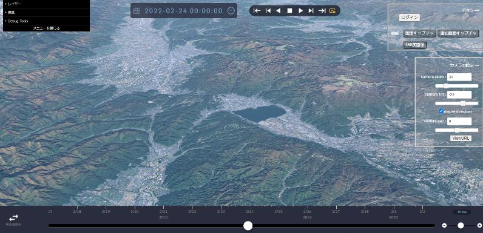

右上の「ログイン」をクリックしてアプリケーションにログインすると、下記のような画面が表示される

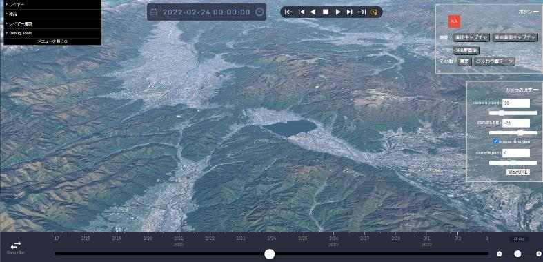

#### レイヤパネル機能
画面左上には「レイヤパネル」が表示されている。「メニューを閉じる」または「メニューを開く」をクリックすることによって、「レイヤパネル」全体を折りたたみ表示または通常表示となる。


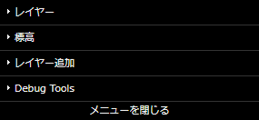

全体を折りたたみ表示する下記のような画面が表示される

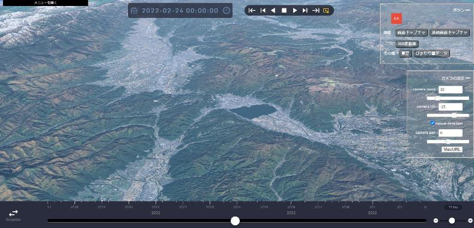

##### レイヤの表示、非表示の切り替え
 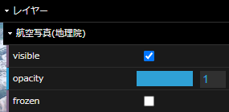

メニュー内のレイヤを展開し、「visible」のチェックボックスにチェックを入れることで、地図上にレイヤを表示ができる。また、「visible」のチェックボックスのチェックを外すことで、地図上へのレイヤを非表示できる。

##### レイヤの透過度の変更


メニュー内のレイヤを展開し、「opacity」の数値を変更することによって、地図上に表示されるレイヤの透明度を調整することができる。0で完全に不透明になり、1で完全表示される。

##### レイヤの固定


メニュー内のレイヤを展開し、「frozen」にチェックボックスにチェックを入れると、そのレイヤの自動更新が停止される。


##### 標高
「標高」レイヤを展開すると、「DEM」レイヤが表示される

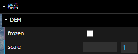

「DEM」レイヤを展開し、「scale」の数値を変更することによって、標高の倍率を変更できる。

##### その他の機能
テンプレートアプリケーションには、開発時に便利なデバッグツールが付属している。

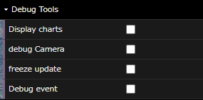

・「Display charts」：地図上に下記のチャートが表示される。


※ピンク：texture count　青：geometry count

・『debug Camera』：地図の右下に下記のような図が表示される。

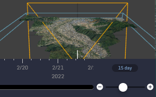

・『freeze update』：自動更新を停止する。

・『Debug event』：下記のように[Events]レイヤがメニューに追加され、地図の緯度経度を確認できる。

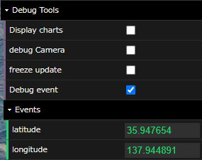

※「latitude」・・・緯度、「longitude」・・・経度
****
#### タイムライン機能
本アプリケーションには、3.1タイムスライダーが組み込んである。機能詳細は同項を参照。

##### 日付の変更


地図上部に表示されているカレンダーアイコンをクリックすると、下記のカレンダーが表示されるので、こちらから日付を変更できる。

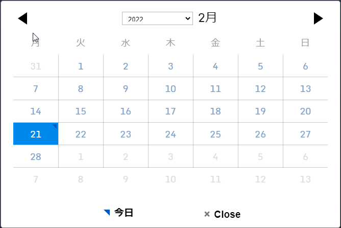

##### 時間の変更


時計アイコンをクリックすると、時刻がカレントタイムに移動します。

##### タイムスライダーの再生
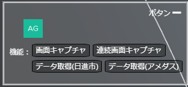

再生設定アイコンをクリックすると、下記の再生設定メニューが表示される。

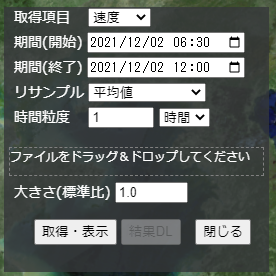

再生設定メニュー内の「再生モード」、「再生間隔」/「再生速度」、「コマ送り間隔」をそれぞれ設定し、再生ボタンをクリックすると、タイムラインが再生される。

##### タイムスライダーで日付と時間の変更
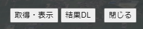

地図下部にあるタイムスライダーのつまみをスライドさせることによって、時刻の変更を行うことができる。

#### その他の機能
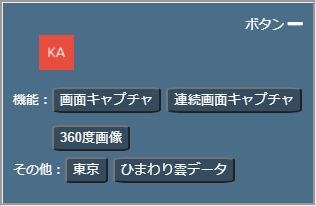

赤枠部の表示はログインユーザー名に従って変更される。


##### 画面キャプチャ
「画面キャプチャ」ボタンをクリックすると、画面キャプチャ機能が呼び出され、ディスプレー画面全体やウインドーに表示された画面のスクリーンショットがダウンロードされる。


##### 連続画面キャプチャ
本アプリケーションには、3.4連続画像キャプチャが組み込んである。機能詳細は同項を参照。

「連続画面キャプチャ」ボタンをクリックすると、連続画面キャプチャ機能が呼び出され、ディスプレー画面全体やウインドーに表示された画面のスクリーンショットが連続でダウンロードされる。


##### 360度画像
本アプリケーションには、3.5 360度画像保存が組み込んである。機能詳細は同項を参照。

「360度画像」ボタンをクリックすると、作成した画面（動画像、静止画像）のスクリーンショットがダウンロードされる。


##### ひまわり雲データ


「ひまわり雲データ」ボタンをクリックすると、下記のように地図上にひまわり雲データが表示される。

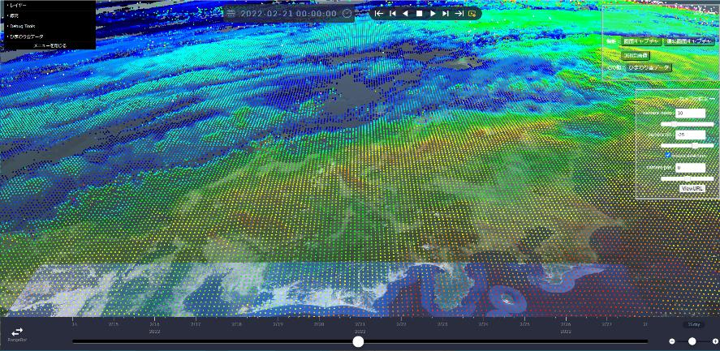


##### アニメーション移動ボタン


「東京」ボタンをクリックすると、アニメーション移動テンプレートとして、現在位置から東京レインボーブリッジ付近へのアニメーション移動機能が起動する。下記のような表示となる。

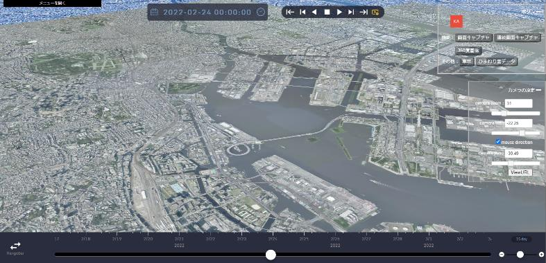


##### カメラ設定
地図の右部にある「カメラの設定」からカメラ設定を行うことができる。

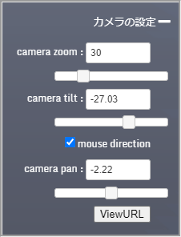

###### カメラズーム
「camera zoom」の数値を変更する、もしくは「camera zoom」下のバーのつまみを移動することによって、地図の拡大・縮小を行うことができる。数値が大きいほど地図が拡大され、低いほど拡大される。


###### カメラ傾斜
「camera tilt」の数値を変更する、もしくは「camera tilt」下のバーのつまみを移動することによってことによって、カメラの傾斜を変更することができる。90で真上を見て、-90で真下を見る。


###### カメラ回転
「camera pan」の数値を変更する、もしくは「camera pan」下のバーのつまみを移動することによってことによって、カメラを回転することができる。1～180は時計回りに回転、-1～-180は反時計回りに回転する。


###### ViewURL
本アプリケーションには、3.2ViewURLが組み込んである。機能詳細は同項を参照。

「ViewURL」ボタンをクリックすると、ViewURL機能が呼び出され、現在の画面のURLが表示される


### 災害状況可視化WebGISアプリケーション
#### アプリケーションの起動
ブラウザからhttps://tb-gis-web.jgn-x.jp/itowns_template/ にアクセスして起動する。ログインが必要な場合は、画面の指示に従ってログインを行う。起動すると下記のような画面が表示される。

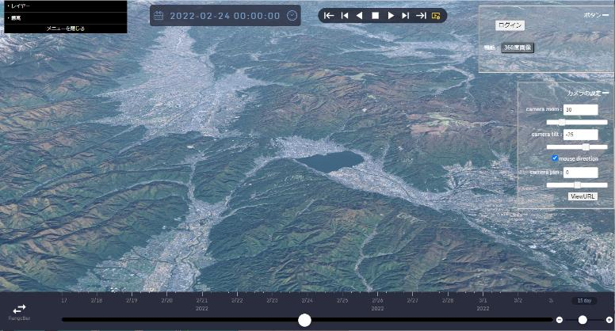

右上の「ログイン」をクリックしてアプリケーションにログインすると、下記のような画面が表示される

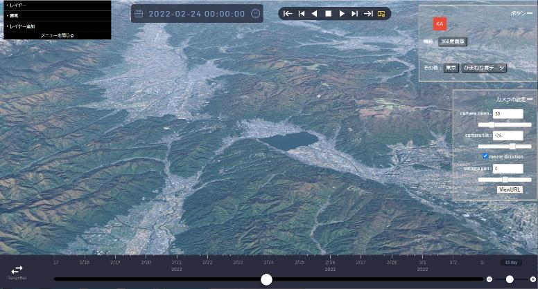

#### レイヤパネル機能
画面左上には「レイヤパネル」が表示されている。「メニューを閉じる」または「メニューを開く」をクリックすることによって、「レイヤパネル」全体を折りたたみ表示または通常表示となる。


全体を折りたたみ表示する下記のような画面が表示される

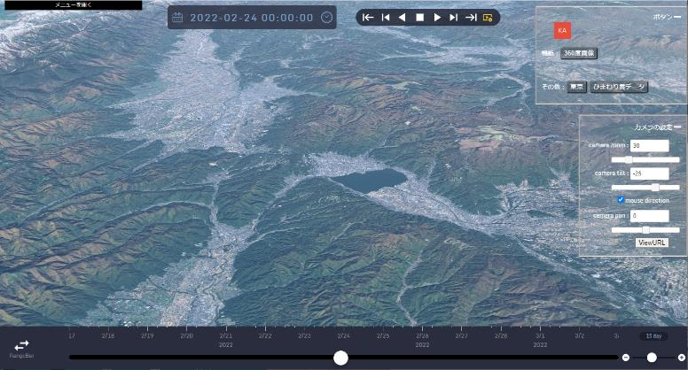
##### レイヤの表示、非表示の切り替え
 

メニュー内のレイヤを展開し、「visible」のチェックボックスにチェックを入れることで、地図上にレイヤを表示ができる。また、「visible」のチェックボックスのチェックを外すことで、地図上へのレイヤを非表示できる。

##### レイヤの透過度の変更


メニュー内のレイヤを展開し、「opacity」の数値を変更することによって、地図上に表示されるレイヤの透明度を調整することができる。0で完全に不透明になり、1で完全表示される。

##### レイヤの固定


メニュー内のレイヤを展開し、「frozen」にチェックボックスにチェックを入れると、そのレイヤの自動更新が停止される。


##### 標高
「標高」レイヤを展開すると、「DEM」レイヤが表示される


「DEM」レイヤを展開し、「scale」の数値を変更することによって、標高の倍率を変更できる。

##### その他の機能
テンプレートアプリケーションには、開発時に便利なデバッグツールが付属している。


・「Display charts」：地図上に下記のチャートが表示される。


※ピンク：texture count　青：geometry count

・『debug Camera』：地図の右下に下記のような図が表示される。


・『freeze update』：自動更新を停止する。

・『Debug event』：下記のように[Events]レイヤがメニューに追加され、地図の緯度経度を確認できる。


※「latitude」・・・緯度、「longitude」・・・経度
****
#### タイムライン機能
本アプリケーションには、3.1タイムスライダーが組み込んである。機能詳細は同項を参照。

##### 日付の変更


地図上部に表示されているカレンダーアイコンをクリックすると、下記のカレンダーが表示されるので、こちらから日付を変更できる。


##### 時間の変更


時計アイコンをクリックすると、時刻がカレントタイムに移動します。

##### タイムスライダーの再生


再生設定アイコンをクリックすると、下記の再生設定メニューが表示される。


再生設定メニュー内の「再生モード」、「再生間隔」/「再生速度」、「コマ送り間隔」をそれぞれ設定し、再生ボタンをクリックすると、タイムラインが再生される。

##### タイムスライダーで日付と時間の変更


地図下部にあるタイムスライダーのつまみをスライドさせることによって、時刻の変更を行うことができる。

#### その他の機能
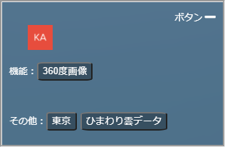

赤枠部の表示はログインユーザー名に従って変更される。


##### 360度画像
本アプリケーションには、3.5 360度画像保存が組み込んである。機能詳細は同項を参照。

「360度画像」ボタンをクリックすると、作成した画面（動画像、静止画像）のスクリーンショットがダウンロードされる。


##### ひまわり雲データ


「ひまわり雲データ」ボタンをクリックすると、下記のように地図上にひまわり雲データが表示される。


##### アニメーション移動ボタン


「東京」ボタンをクリックすると、アニメーション移動テンプレートとして、現在位置から東京レインボーブリッジ付近へのアニメーション移動機能が起動する。下記のような表示となる。


##### カメラ設定
地図の右部にある「カメラの設定」からカメラ設定を行うことができる。


###### カメラズーム
「camera zoom」の数値を変更する、もしくは「camera zoom」下のバーのつまみを移動することによって、地図の拡大・縮小を行うことができる。数値が大きいほど地図が拡大され、低いほど拡大される。


###### カメラ傾斜
「camera tilt」の数値を変更する、もしくは「camera tilt」下のバーのつまみを移動することによってことによって、カメラの傾斜を変更することができる。90で真上を見て、-90で真下を見る。


###### カメラ回転
「camera pan」の数値を変更する、もしくは「camera pan」下のバーのつまみを移動することによってことによって、カメラを回転することができる。1～180は時計回りに回転、-1～-180は反時計回りに回転する。


###### ViewURL
本アプリケーションには、3.2ViewURLが組み込んである。機能詳細は同項を参照。

「ViewURL」ボタンをクリックすると、ViewURL機能が呼び出され、現在の画面のURLが表示される


## ライブラリ
### タイムスライダー
#### 概要
　タイムスライダーは、操作することにより表示している画面の現在時刻を変える機能である。天候のように時々刻々と変化するデータを、時系列に沿って確認するために使用する。

#### 現在時刻の変更
機能詳細：
　現在時刻を変更することで、表示しているデータの時刻を切り替えることができる。

手順：
マウスでつまみを左右にドラッグする。

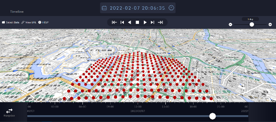

```
左右にドラッグ

```


あるいは、タイムスライダーの任意の場所をクリックする。


```
移動したい時間をクリック
```


カレンダーボタンをタップすることで、任意の日付に切り替わる。

```
カレンダーボタンをクリック
```


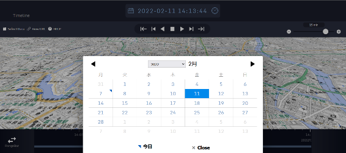

```
切り替えたい日付をクリック
```


#### 自動再生
機能詳細：
　表示している現在時刻を自動で時々刻々と変化させる。

手順：
　再生ボタンをタップする

```
タップ
```

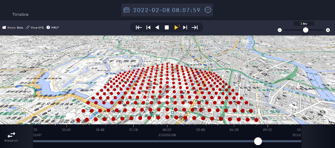

再度タップすることで、再生速度を変更できる(5段階)。
また、逆側の再生ボタンをタップすることで、逆方向への再生を行うことができる。

自動再生を終了したい場合、停止ボタンを押下する。

```
タップ
```


#### スキップ
機能詳細：
　特定の時間だけ早送り、あるいは巻き戻しを行う。

手順：
　以下のいずれかの操作を行う。
▶|ボタンタップ：短時間のスキップ
→|ボタンタップ：時間軸バー目盛の縮尺で設定されている値だけ時間をスキップ
|◀ボタンタップ：逆方向の短時間のスキップ
|←ボタンタップ：時間軸バー目盛の縮尺で設定されている値だけ時間を逆方向にスキップ

```
タップ
```

#### 縮尺の変更
機能詳細：
　操作する時間の縮尺を変えることで、自動再生時の時間の進み方を調整する。

手順：
　以下のいずれかの操作を行う。
⊕ボタンタップ：縮尺が短くなる。
⊖ボタンタップ：縮尺が長くなる。
つまみを動かす：任意の縮尺に切り替える。
時間軸バーでホイールを操作：縮尺を変更する。


```
タップ
```


```
ホイール操作
```

#### 現在時刻への切り替え
機能詳細：
　表示している現在時刻を、実際の時刻に合わせる。また、リアルタイム更新を行うことができる。

手順：
　時計ボタンをタップする。
```
タップ
```


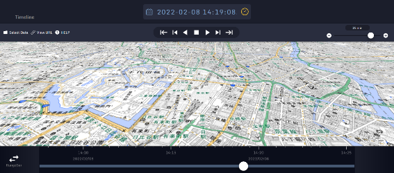

再度時計ボタンをタップすると、現在時刻がリアルタイム更新される。リアルタイム更新中は、時計ボタンが点滅する。

```
点滅する
```


#### 開始時刻、終了時刻の変更
機能詳細：
　時間軸領域に表示している開始時刻と終了時刻を調整する。

手順：
　時間軸領域をドラッグする。


```
ドラッグ
```


#### タイムレンジの指定
機能詳細：
　特定の範囲を設定することで、その区間のみ現在時刻を変更できるようになる。また、その区間を繰り返しで再生できる。

手順：
　RangeBarボタンをタップする。

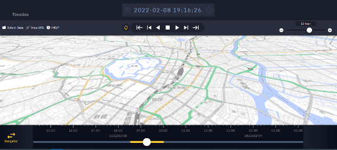


```
タップ
```


繰り返しボタンをタップすることで、タイムレンジの範囲を繰り返しで自動再生する。

```
タップ
```


タイムレンジの端をドラッグすることで、開始時刻と終了時刻を変更できる。


```
ドラッグ
```


### ViewURL
#### 概要
表示している時空間情報及び表示データ情報をURL（URI）で表示（一時記録）できる機能（ViewURL機能）。さらに生成したURLを用いて、他のユーザがデータ表示を再現できる。

#### 表示データ情報の一時記録
ViewURL作成ボタンをクリックする。

```
ViewURL作成ボタン
```
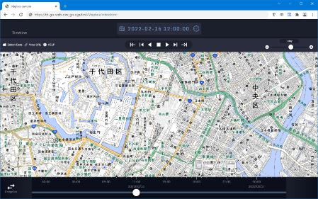

生成されたURLをコピーする。

```
作成されたURL
```
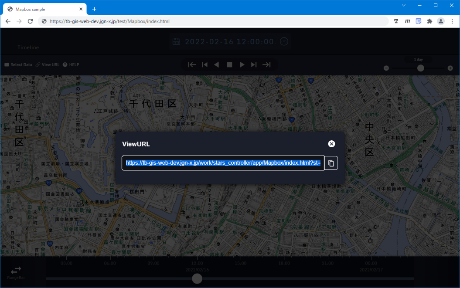
#### 表示データ情報の復元
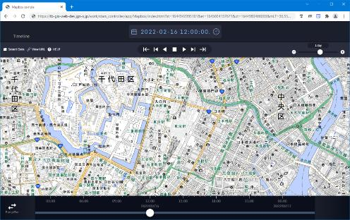

ViewURL機能で作成したURLをアドレスバーへコピーして、WebGISアプリケーションを表示する。


### 時空間同期機能
#### 概要
複数のWebアプリケーションの時空間情報の同期機能。StarsControllerライブラリを組み込んだ親アプリケーションを起動すると、同期対象のアプリケーションを複数起動し、それらが同期される。

#### 空間同期
同期対象のアプリケーションのいずれかの地図を操作する。

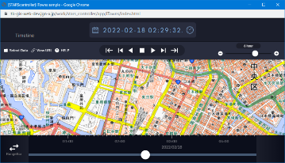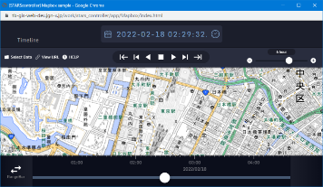


```
地図の操作
```


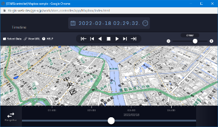


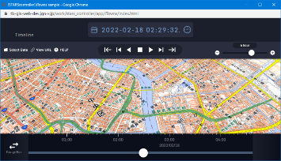


#### 時間同期
同期対象のアプリケーションのいずれかのタイムスライダーを操作する。


```
タイムスライダーの操作
```


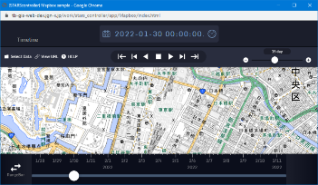


### 連続画像キャプチャ
#### 概要
データを時間方向に自動再生しながら、タイムラインとの画像を静止画像として複数枚キャプチャする機能。

#### 連続画像キャプチャ
キャプチャ開始。ブラウザのダイアログ等でキャプチャの対象を選択し、キャプチャ実施の許可を出す。

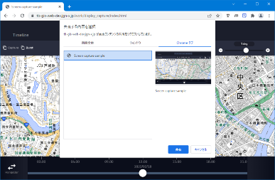

自動再生しながら、各ステップでキャプチャが取得される。

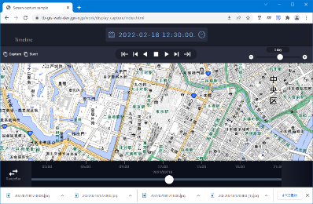


### 360度画像保存
#### 概要
　360度画像保存は、表示している地図の中心から360度を囲う画像を作成し保存する機能である。

#### サブビューの表示/非表示
機能詳細：
360度画像保存に使用する、保存対象確認のためのサブビューの表示と非表示の切り替えを行う。

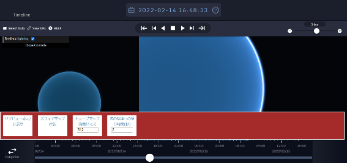

```
サブビュー
```


手順：
サブビューの表示/非表示ボタンをクリックする。


```
クリック
```
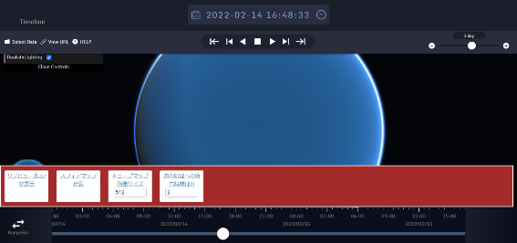


再度クリックすることで、非表示に切り替わる。


```
クリック
```


#### 360度画像保存
機能詳細：
　表示している地図の中心から360度を囲う画像を作成し保存する。

手順：
　スフィアマップ作成ボタンをクリックする。


```
クリック
```


360度画像作成完了後、自動的にダウンロードが行われる。

#### 解像度変更
機能詳細：
　作成する360度画像の解像度を変更する。
作成される画像は指定した値をSとすると,4S × 2Sのサイズとなる。
解像度の最低は1、最高は1024とする。
初期値は512が設定されている。

手順：
　キューブマップ画像サイズの入力値を変更する。


```
解像度を入力
```


入力した解像度は、入力と同時に反映される。
#### 次の処理への待ち時間変更
機能詳細：
　保存対象の領域の中に取得できない地図画像が存在していた場合、該当箇所の画像作成が完了しなくなることがある。そのようなケースに画像作成を中断し次の処理へと移すための待ち時間を変更する。
極端に短い時間を指定した場合、作成した画像のエンコードが途中で終了するため、画質が荒くなることに注意すること。
初期値は2秒が設定されている。

手順：
　次の処理への待ち時間の入力値を変更する。


```
待ち時間を入力
```


