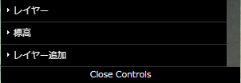
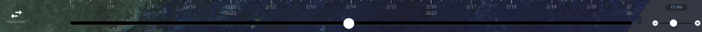

# 時系列・地理空間情報に関するデータ分析・可視化システムの試作と実装マニュアル

## WebGISアプリケーション
### 3次元テンプレートWebGISアプリケーション
#### アプリケーションの起動
ブラウザからhttps://tb-gis-web.jgn-x.jp/itowns_template/ にアクセスして起動する。ログインが必要な場合は、画面の指示に従ってログインを行う。起動すると下記のような画面が表示される。

右上の「ログイン」をクリックしてアプリケーションにログインすると、下記のような画面が表示される。

### レイヤパネル機能
画面左上には「レイヤパネル」が表示されている。「メニューを閉じる」または「メニューを開く」をクリックすることによって、「レイヤパネル」全体を折りたたみ表示または通常表示となる。

全体を折りたたみ表示する下記のような画面が表示される。

#### レイヤの表示、非表示の切り替え

メニュー内のレイヤを展開し、「visible」のチェックボックスにチェックを入れることで、地図上にレイヤを表示ができる。また、「visible」のチェックボックスのチェックを外すことで、地図上へのレイヤを非表示できる。

#### レイヤの透過度の変更

メニュー内のレイヤを展開し、「opacity」の数値を変更することによって、地図上に表示されるレイヤの透明度を調整することができる。0で完全に不透明になり、1で完全表示される。

#### レイヤの固定

メニュー内のレイヤを展開し、「frozen」にチェックボックスにチェックを入れると、そのレイヤの自動更新が停止される。

#### レイヤの削除

メニュー内のレイヤを展開し、「delete」をクリックすると、そのレイヤをメニューから削除する。

#### 標高
「標高」レイヤを展開すると、「DEM」レイヤが表示される。

「DEM」レイヤを展開し、「scale」の数値を変更することによって、標高の倍率を変更できる。

### タイムライン機能
本アプリケーションには、3.1 タイムスライダーが組み込んである。機能詳細は同項を参照。

#### 日付の変更

地図上部に表示されているカレンダーアイコンをクリックすると、下記のカレンダーが表示されるので、こちらから日付を変更できる。

#### 時間の変更

時計アイコンをクリックすると、時刻がカレントタイムに移動する。

#### タイムスライダーの再生

再生設定アイコンをクリックすると、下記の再生設定メニューが表示される。

再生設定メニュー内の「コマ送り速度」、「コマ送り間隔」をそれぞれ設定し、再生ボタンをクリックすると、タイムラインが再生される。

#### タイムスライダーで日付と時間の変更

地図下部にあるタイムスライダーのつまみをスライドさせることによって、時刻の変更を行うことができる。

### 地図表示操作機能

　画面の左下に地図の表示を操作できる複数のボタンがある。

　また、画面の右下には地図の拡大、縮小に対応したスケールバーがある。

#### 各ボタンの説明

７つのボタンが用意されている。上から順に説明する。

  * 地図の表示を初期の位置に戻す。
  * 地図の表示を上側に傾ける。
  * 地図の表示を下側に傾ける。
  * 地図の表示を拡大する。
  * 地図の表示を縮小する。
  * 地図の表示を3Dにする。
  * 北が真上になるように地図を表示する。

### その他の機能

赤枠部の表示はログインユーザー名に従って変更される。

#### 画面キャプチャ
「画面キャプチャ」ボタンをクリックすると、画面キャプチャ機能が呼び出され、ディスプレー画面全体やウインドーに表示された画面のスクリーンショットがダウンロードされる。

#### 連続画面キャプチャ
本アプリケーションには、3.4 連続画像キャプチャが組み込んである。機能詳細は同項を参照。

「連続画面キャプチャ」ボタンをクリックすると、連続画面キャプチャ機能が呼び出され、ディスプレー画面全体やウインドーに表示された画面のスクリーンショットが連続でダウンロードされる。

#### データ取得(日進市)
「データ取得(日進市)」ボタンをクリックすると、日進市の周辺にカメラが移動し、移動体データを表示させるための項目選択画面が表示される。

  * 取得項目：取得する日進市データの種類を設定でき、「速度」と「PM2.5」が選択できる。
  * 期間(開始)：取得する日進市データ範囲の開始期間を設定する。
  * 期間(終了)：取得する日進市データ範囲の終了期間を設定する。
  * リサンプル：取得する日進市データの値を設定でき、「平均値」「最大値」「最小値」「スプライン補間」「線形補間」が選択できる。(※)
  * 時間粒度：取得する日進市データの値を設定する時間粒度で、取得する日進市データの時間間隔を設定する。
  * 大きさ(標準比)：表示されているオブジェクトの大きさを変更する。

※リサンプル項目が、「平均値」、「最大値」、「最小値」の場合、時間粒度の選択項目は、「年」「月」「日」「時間」「分」になる。また、リサンプル項目が、「スプライン補間」「線形補間」の場合、時間粒度の選択項目は、「秒」のみになる。

それぞれの項目を選択し、「取得・表示」をクリックすると、選択した項目に該当する範囲の移動体データが画面に表示される。

移動体データの取得が完了すると、「結果DL」がクリックできるようになる。「結果DL」をクリックすると、取得した範囲の移動体データがJSONファイルとして出力される。

#### データ取得(アメダス)
「データ取得(アメダス)」ボタンをクリックすると、移動体データを表示させるための項目選択画面が表示される。

  * 取得項目：取得するアメダスデータの種類を設定でき、「24時間降雨量」と「気温」「積雪深」が選択できる。
  * 期間(開始)：取得するアメダスデータ範囲の開始期間を設定する。
  * 期間(終了)：取得するアメダスデータ範囲の終了期間を設定する。
  * リサンプル：取得するアメダスデータの値を設定でき、「平均値」「最大値」「最小値」「スプライン補間」「線形補間」が選択できる。(※)
  * 時間粒度：取得するアメダスデータの値を設定する時間粒度で、取得する日進市データの時間間隔を設定する。
  * 大きさ(標準比)：表示されているオブジェクトの大きさを変更する。

※リサンプル項目が、「平均値」、「最大値」、「最小値」の場合、時間粒度の選択項目は、「年」「月」「日」「時間」「分」になる。また、リサンプル項目が、「スプライン補間」「線形補間」の場合、時間粒度の選択項目は、「分」と「秒」のみになる。

それぞれの項目を選択し、「取得・表示」をクリックすると、選択した項目に該当する範囲の移動体データが画面に表示される。

移動体データの取得が完了すると、「結果DL」がクリックできるようになる。「結果DL」をクリックすると、取得した範囲の移動体データがJSONファイルとして出力される。

#### カメラ設定
地図の右部にある「カメラの設定」からカメラ設定を行うことができる。

##### カメラズーム
「camera zoom」の数値を変更する、もしくは「camera zoom」下のバーのつまみを移動することによって、地図の拡大・縮小を行うことができる。数値が大きいほど地図が拡大され、低いほど拡大される。

##### カメラ傾斜
「camera tilt」の数値を変更する、もしくは「camera tilt」下のバーのつまみを移動することによってことによって、カメラの傾斜を変更することができる。90で真上を見て、-90で真下を見る。

##### カメラ回転
「camera pan」の数値を変更する、もしくは「camera pan」下のバーのつまみを移動することによってことによって、カメラを回転することができる。1～180は時計回りに回転、-1～-180は反時計回りに回転する。

##### ViewURL
本アプリケーションには、3.2 ViewURLが組み込んである。機能詳細は同項を参照。

「ViewURL」ボタンをクリックすると、ViewURL機能が呼び出され、現在の画面のURLが表示される

##### Set Position
「latitude」、「longitude」、「altitude」の3つの項目に任意の数字を入れ、「Set Position」のボタンをクリックすると、その座標を中心として地図が表示される。

