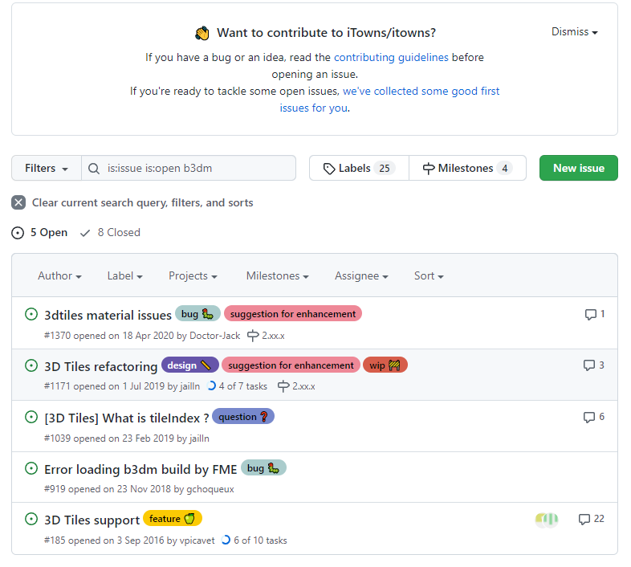

# 時系列・地理空間情報に関するデータ分析・可視化システムの試作と実装採用フレームワーク課題報告書

## 本システムで使用するOSSの課題
### iTonws
#### レイヤ追加時に既存のレイヤに強制的に再描画が発生する現象について
iTowns 2.37.0 (2022-01-31) で確認できる現象として、レイヤ追加時に既存の表示レイヤに強制的に再描画が発生し、一旦表示解像度が極端に低下した状態になる課題があります。
iTowns issues
[https://github.com/iTowns/itowns/issues](https://github.com/iTowns/itowns/issues)

の課題として

[https://github.com/iTowns/itowns/issues/1082](https://github.com/iTowns/itowns/issues/1082)

が報告されており、リリース前の修正提案等についても未実施の状態です。

#### PLATEAUで公開されるb3dmファイルの読み込み不具合について
国土交通省Project PLATEAUで公開されているb3dmファイルの読み込みについて、内部のバイナリフィーチャテーブルは未対応であることが判明しております。

[https://github.com/iTowns/itowns/blob/6953e0119c35a550621aa792a204c352731aca97/src/Parser/B3dmParser.js#L134](https://github.com/iTowns/itowns/blob/6953e0119c35a550621aa792a204c352731aca97/src/Parser/B3dmParser.js)

また、2022/02/24時点でb3dmファイルの取り扱いに関すると想定される複数のIssueがOpenされています。また、上の現象は直接的には

[https://github.com/iTowns/itowns/issues/185](https://github.com/iTowns/itowns/issues/185)

の状況により動作に改善があると想定されます。

図 21　 b3dmに関連したIssue

#### 開発着手時の最新版が一部機能について後方互換性を持たないことについて
検討を主とした開発開始時期の最新版である2.35.0 (2021-09-16)の数か月前のリリースである2.33.0 (2021-05-28)でBREAKING CHANGES(破壊的な変更)が発生しております。

[https://github.com/iTowns/itowns/releases/tag/v2.33.0](https://github.com/iTowns/itowns/releases/tag/v2.33.0)

これらの変更、及びその2.34.0 (2021-07-30)で発生しているパッケージの更新

[https://github.com/iTowns/itowns/commit/50cd744](https://github.com/iTowns/itowns/commit/50cd744)

が360度形式画像(静止画像および時系列動画像)ライブラリに悪影響を及ぼしている可能性が高く、2.35.0 (2021-09-16)以降では動作しなくなっております。パッケージ更新では3Dレンダリングを受け持つThree.jsの推奨バージョンにも変更が発生しております。

### MapBox
別途記載

